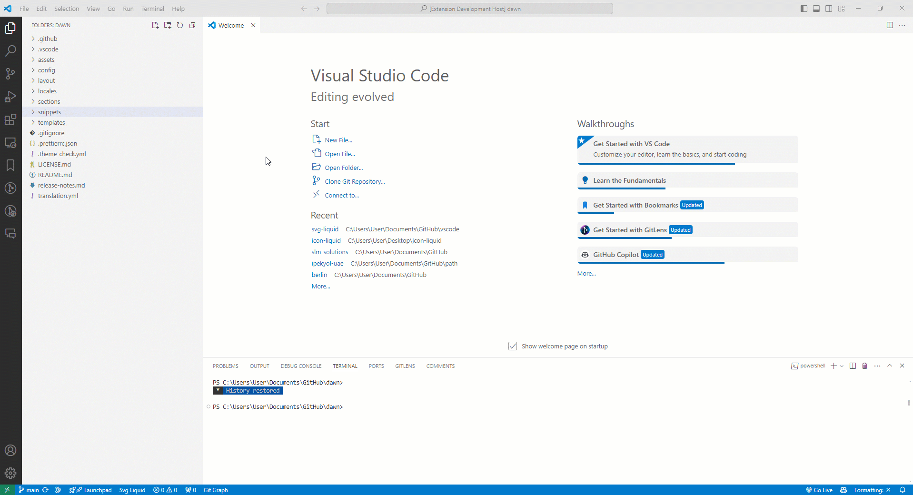

# Svg Liquid

In order to reuse SVG icons while developing a Shopify theme, it is necessary to convert them to Liquid extensions and call them as snippets.

After a while, when the number of icons increases, it becomes quite difficult to manage and preview them. This VSCode plugin was developed to make this process easier to manage

## Screenshot

## Requirements

- Icon files must start with `icon-`
- Icon file contents must start with `<svg`